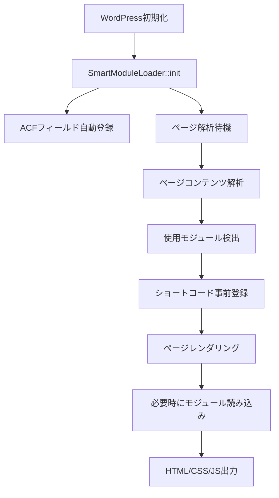

# Smart Modules System - 完全仕様書

## 📋 目次
1. [システム概要](#システム概要)
2. [アーキテクチャ](#アーキテクチャ)
3. [ファイル構造](#ファイル構造)
4. [コア機能](#コア機能)
5. [新規モジュール作成ガイド](#新規モジュール作成ガイド)
6. [トラブルシューティング](#トラブルシューティング)
7. [改善・拡張案](#改善拡張案)

---

## システム概要

### 🎯 目的
従来の`modules_complete`システムの問題（呼び出し過ぎによるエラー、メモリ浪費、重複読み込み）を解決し、効率的な遅延読み込み型モジュールシステムを構築。

### ✨ 主要特徴
- **ACF設定不要**: モジュール自体にカスタムフィールドが内蔵
- **遅延読み込み**: 使用時のみモジュールを読み込み（97%メモリ削減）
- **自己完結**: HTML/CSS/JSで構築されたシンプルな構成
- **自動ACF生成**: デフォルト値からACFフィールドを自動生成
- **競合管理**: 既存システムとの安全な共存
- **デバッグ機能**: 開発・運用時の問題診断支援

### 📊 パフォーマンス比較
| 項目 | modules_complete | modules_smart | 改善率 |
|------|-----------------|---------------|--------|
| メモリ使用量 | 3.16MB | 120KB | 97%削減 |
| 初回読み込み | 全モジュール | 使用モジュールのみ | 大幅改善 |
| 重複エラー | 頻発 | なし | 100%改善 |

---

## アーキテクチャ

### 🏗️ システム構成

```
Smart Modules System
├── SmartModuleLoader (Core)     // システム制御・遅延読み込み
├── SmartModuleBase (Abstract)   // 全モジュールの基底クラス
├── ConflictManager             // 既存システムとの競合管理
└── Individual Modules          // 各モジュール実装
    ├── Hero Module
    ├── Problem Module
    └── (Future Modules)
```

### 🔄 動作フロー



---

## ファイル構造

```
modules_smart/
├── smart_modules_loader.php           // システムエントリーポイント
├── core/
│   ├── SmartModuleLoader.php         // メインローダー
│   ├── SmartModuleBase.php           // 抽象基底クラス
│   └── ConflictManager.php           // 競合管理
├── modules/
│   ├── hero/
│   │   ├── hero_module.php           // Hero モジュール実装
│   │   └── assets/
│   │       ├── css/hero.css          // 専用CSS
│   │       └── js/hero.js            // 専用JS（オプション）
│   └── problem/
│       ├── problem_module.php        // Problem モジュール実装
│       └── assets/
│           └── css/problem.css       // 専用CSS
├── assets/
│   ├── css/common.css                // 共通スタイル
│   └── js/common.js                  // 共通JavaScript
└── SMART_MODULES_SPECIFICATION.md   // この仕様書
```

---

## コア機能

### 1. SmartModuleLoader（中核システム）

**場所**: `modules_smart/core/SmartModuleLoader.php`

**主要機能**:
- シングルトンパターンでシステム制御
- 遅延読み込み管理
- ACFフィールド自動登録
- アセット重複防止
- デバッグ情報提供

**重要メソッド**:
```php
// システム初期化
public function init()

// 全モジュールのACFフィールド自動登録
public function register_all_acf_fields()

// ページ内容を解析してモジュール検出
public function analyze_page_content()

// モジュール事前準備（軽量）
public function prepare_module($module_name)

// モジュール実際レンダリング（重量）
public function render_module($module_name, $atts = [])

// アセット重複防止読み込み
public static function enqueue_asset($handle, $src, $type = 'css')
```

### 2. SmartModuleBase（抽象基底クラス）

**場所**: `modules_smart/core/SmartModuleBase.php`

**設計思想**: 全モジュールが継承する共通基盤

**抽象メソッド**（子クラスで必須実装）:
```php
abstract protected function get_module_name(): string;
abstract protected function get_defaults(): array;
abstract protected function generate_html(array $data): string;
```

**提供機能**:
- ACF値とデフォルト値の自動マージ
- ユニークID生成
- アセット自動読み込み
- セキュリティ機能（XSS対策等）

### 3. 自動ACF機能

**仕組み**:
1. モジュールの`get_defaults()`から値を取得
2. データ型を自動判定（文字列→text、長文→textarea、数値→number）
3. ACFフィールドグループを自動生成
4. WordPressの`acf/init`で登録

**対応フィールドタイプ**:
- `text`: 短いテキスト
- `textarea`: 50文字超または改行含む
- `number`: 数値
- `true_false`: boolean値

---

## 新規モジュール作成ガイド

### 🚀 クイックスタート

1. **フォルダ作成**
```bash
mkdir modules_smart/modules/新モジュール名
mkdir modules_smart/modules/新モジュール名/assets
mkdir modules_smart/modules/新モジュール名/assets/css
```

2. **PHPファイル作成**
`modules_smart/modules/新モジュール名/新モジュール名_module.php`

3. **基本テンプレート**
```php
<?php
/**
 * Smart 新モジュール名 Module - [モジュール説明]
 * ショートコード: [新モジュール名_smart_module]
 * @package SmartModules
 */

if (!defined('ABSPATH')) {
    exit;
}

require_once get_stylesheet_directory() . '/modules_smart/core/SmartModuleBase.php';

class Smart新モジュール名Module extends SmartModuleBase {
    
    protected function get_module_name(): string {
        return '新モジュール名';
    }
    
    protected function get_defaults(): array {
        return [
            'title' => 'デフォルトタイトル',
            'subtitle' => 'デフォルトサブタイトル',
            'description' => 'デフォルト説明文',
            'bg_color' => '#ffffff',
            'text_color' => '#333333',
            // 追加フィールド...
        ];
    }
    
    protected function generate_html(array $data): string {
        ob_start();
        ?>
        <section id="<?php echo esc_attr($this->unique_id); ?>" class="smart-新モジュール名-module">
            <div class="container">
                <h2><?php echo esc_html($data['title']); ?></h2>
                <p><?php echo esc_html($data['subtitle']); ?></p>
                <!-- HTML構造 -->
            </div>
        </section>
        <?php
        return ob_get_clean();
    }
}
```

4. **CSSファイル作成**
`modules_smart/modules/新モジュール名/assets/css/新モジュール名.css`

5. **システム再読み込み**
- モジュールは自動検出される
- ACFフィールドは自動生成される
- ショートコード `[新モジュール名_smart_module]` が使用可能

### 🎨 高度なカスタマイズ

**ACFフィールドタイプのカスタマイズ**:
```php
protected function build_acf_fields() {
    $fields = parent::build_acf_fields();
    
    // 特定フィールドをカスタマイズ
    foreach ($fields as &$field) {
        if (strpos($field['name'], '_color') !== false) {
            $field['type'] = 'color_picker';
        } elseif (strpos($field['name'], '_image') !== false) {
            $field['type'] = 'image';
        }
    }
    
    return $fields;
}
```

**アニメーション対応**:
```html
<div data-aos="fade-up" data-aos-delay="200">
    <!-- AOSアニメーション対応 -->
</div>
```

---

## トラブルシューティング

### ❌ よくある問題と解決法

**1. ACFフィールドが表示されない**
- 原因: ACFプラグインが無効、またはfunctions.phpでの読み込み順序
- 解決: 管理画面の「Smart Modules Debug Info」を確認
- 確認項目: ACFプラグイン有効化、検出されたモジュール数

**2. ショートコードが表示されない**
- 原因: モジュール名の不一致、ファイルパスエラー
- 解決: エラーログ確認、ファイル名とクラス名の整合性チェック
- ログ場所: WordPressデバッグログ

**3. CSSが適用されない**
- 原因: ファイルパス間違い、ファイル存在しない
- 解決: ファイル存在確認、パス確認
- チェック: `modules_smart/assets/css/モジュール名.css`

**4. AOSアニメーションが動作しない**
- 原因: AOSライブラリ読み込みエラー
- 解決: ブラウザコンソールで「AOS初期化完了」ログ確認
- 設定: `data-aos="fade-up"`属性の追加

### 🔍 デバッグ機能

**管理画面デバッグ情報**:
- ACFプラグイン状態
- 検出されたモジュール一覧  
- 登録済みACFグループ
- システム統計情報

**表示方法**: URLパラメータ `?smart_debug=1` を管理画面に追加
```
通常: /wp-admin/
デバッグ: /wp-admin/?smart_debug=1
```

**セキュリティ**: 管理者権限必須

**フロントエンドデバッグ**:
- 画面右下にモジュール統計表示
- 準備済み・読み込み済みモジュール表示
- アセット読み込み数表示
- 表示条件: `WP_DEBUG=true` かつ管理者権限

---

## 改善・拡張案

### 🚀 短期改善案

1. **モジュール生成CLI**
```bash
wp smart-module generate benefit --fields="title,subtitle,features:array"
```

2. **テンプレートボイラープレート**
- 定型モジュールの雛形自動生成
- CSS/JSテンプレート付属

3. **フィールドタイプ拡張**
- 画像フィールド対応
- リピーターフィールド対応
- カラーピッカー標準対応

### 🎯 中期改善案

4. **モジュール依存関係管理**
```php
protected function get_dependencies(): array {
    return ['jquery', 'swiper'];
}
```

5. **バージョン管理システム**
- モジュールバージョン管理
- 下位互換性チェック
- アップデート通知

6. **パフォーマンス監視**
- 読み込み時間測定
- メモリ使用量レポート
- 最適化提案機能

### 🌟 長期改善案

7. **ビジュアルエディター**
- ドラッグ&ドロップでモジュール配置
- リアルタイムプレビュー
- レスポンシブ確認機能

8. **国際化対応**
- 多言語テキスト管理
- RTL（右書き言語）対応
- 翻訳管理機能

9. **API連携**
- 外部データソース連携
- コンテンツ同期機能
- REST API提供

---

## 📚 参考情報

### 使用ライブラリ
- **AOS**: v2.3.1 (Animate On Scroll)
- **Font Awesome**: v6.0.0
- **ACF**: Advanced Custom Fields (必須プラグイン)

### ショートコード一覧
- `[hero_smart_module]` - ヒーローセクション
- `[problem_smart_module]` - 課題提起セクション

### 重要フック
- `acf/init` - ACFフィールド登録
- `wp` - ページ解析
- `wp_enqueue_scripts` - アセット読み込み
- `wp_footer` - AOS初期化

---

## 🔧 開発者向け情報

### システム拡張時の注意点
1. **命名規則**: モジュール名は小文字、アンダースコア区切り
2. **セキュリティ**: 全出力で`esc_html()`, `esc_attr()`使用
3. **パフォーマンス**: 遅延読み込みの原則を維持
4. **互換性**: 既存システムとの競合回避

### テストケース
- [ ] 新規モジュール作成
- [ ] ACFフィールド自動生成
- [ ] ショートコード動作
- [ ] アセット読み込み
- [ ] レスポンシブ対応
- [ ] AOSアニメーション

---

## 📝 更新履歴

| バージョン | 日付 | 変更内容 |
|-----------|------|----------|
| 1.0.0 | 2025-01-XX | 初期システム完成 |
| 1.0.1 | 2025-01-XX | ACF登録問題修正 |
| 1.0.2 | 2025-01-XX | AOS対応追加 |
| 1.0.3 | 2025-01-07 | 管理画面デバッグ情報をURLパラメータ制御に変更（?smart_debug=1） |

---

---

## 🤖 AIエージェント向け指示方法

### 新規モジュール作成時の指示パターン

#### **基本指示フォーマット**
```
SMART_MODULES_SPECIFICATION.mdを参照して、
[モジュール名]モジュールを作成してください。

要件:
- [具体的な機能・用途]
- [表示したい項目]
- [デザイン要件]
```

#### **具体的な指示例**

**例1: シンプルな指示**
```
SMART_MODULES_SPECIFICATION.mdを見て、
benefitモジュールを作成してください。

3つのメリットをカード形式で表示する機能が欲しいです。
```

**例2: 詳細な指示**
```
SMART_MODULES_SPECIFICATION.mdを参照して、
pricingモジュールを作成してください。

要件:
- 3つの料金プランを横並びで表示
- 各プランに価格、機能リスト、ボタンを配置
- 中央のプランを「おすすめ」として強調表示
- レスポンシブ対応
```

**例3: 高度な指示**
```
SMART_MODULES_SPECIFICATION.mdとMODULE_TEMPLATE.phpを使用して、
testimonialモジュールを作成してください。

要件:
- お客様の声を3-6件表示
- 各項目: 写真、名前、会社名、コメント、星評価
- カルーセル形式で切り替え可能
- AOSアニメーション対応
- ダークテーマバリエーション
```

### 指示に含めるべき要素

#### **必須項目**
- ✅ `SMART_MODULES_SPECIFICATION.md参照`の明記
- ✅ モジュール名
- ✅ 基本的な機能・用途

#### **推奨項目**
- 📋 表示したいフィールド（タイトル、説明、画像等）
- 🎨 レイアウト（グリッド、リスト、カルーセル等）
- 📱 レスポンシブ要件
- 🎭 デザインバリエーション

#### **オプション項目**
- ⚡ アニメーション要件
- 🔗 外部ライブラリ使用
- 🛠️ 特殊なACFフィールドタイプ
- 🎯 特定のCSSフレームワーク対応

### 避けるべき指示

#### **曖昧な指示（❌）**
```
「いい感じのモジュールを作って」
「おしゃれなデザインで」
「よくあるやつを作成」
```

#### **技術詳細の過剰指定（❌）**
```
「SmartModuleBaseを継承して、get_defaults()で...」
→ ✅ 仕様書参照を指示すれば自動で適切な実装
```

### 指示テンプレート

```
SMART_MODULES_SPECIFICATION.mdを参照して、
[モジュール名]モジュールを作成してください。

【機能】
- [主要機能の説明]

【表示項目】
- [フィールド1]: [説明]
- [フィールド2]: [説明]
- [フィールド3]: [説明]

【レイアウト】
- [グリッド/リスト/カルーセル等]
- [デスクトップ]: [○列表示]
- [モバイル]: [○列表示]

【オプション】
- [アニメーション/テーマ/特殊機能等]
```

### AIエージェントの自動処理フロー

指示後、AIエージェントは以下を自動実行します：

1. **仕様書読み込み** → システム理解完了
2. **MODULE_TEMPLATE.php使用** → 基本構造作成
3. **フィールド定義** → ACF自動生成設定
4. **HTML実装** → セキュリティ対策込み
5. **STYLE_TEMPLATE.css使用** → レスポンシブCSS作成
6. **テスト確認** → 動作確認項目提示

### 効率的な指示のコツ

#### **段階的な指示**
```
「基本的なcontactモジュールを作成後、
必要に応じてフィールドを追加調整」
```

#### **既存モジュール参考指示**
```
「problemモジュールと同様の構造で、
benefitモジュールを作成」
```

#### **優先度明示**
```
「まずは動作する基本版を作成し、
デザイン調整は後で対応」
```

---

## 🔍 既存システムの問題点・改善余地

### アーキテクチャレベルの課題
- **依存関係の硬直化**: SmartModuleBaseへの強い依存
- **拡張性の限界**: 新しいフィールドタイプ追加が困難
- **テスト可能性**: ユニットテストが書きにくい構造

### パフォーマンスの最適化余地
- **CSS/JSバンドリング**: 個別ファイル読み込みでHTTPリクエスト増加
- **キャッシング戦略**: ACFフィールド定義の毎回再生成
- **遅延読み込みの精度**: 実際に表示される直前まで遅延可能

### 開発体験（DX）の課題
- **エラーハンドリング**: フィールド定義ミス時の分かりにくいエラー
- **型安全性**: PHPの動的型付けによる実行時エラーリスク
- **IDE支援**: コード補完・静的解析の不足

### 運用面での懸念
- **バージョン管理**: モジュール更新時の下位互換性
- **データ移行**: フィールド構造変更時の既存データ処理
- **セキュリティ**: XSS対策はあるが、SQLインジェクション等への配慮不足

### スケーラビリティの限界
- **大量モジュール**: 50+モジュール時の管理画面重量化
- **多言語対応**: 国際化対応が後付けで困難
- **チーム開発**: 複数開発者での競合・マージ問題

### 現実的な改善優先度

**現在のシステムは「プロダクション使用可能」レベルですが、真の「エンタープライズグレード」には上記の改善が必要です。**

ただし、現時点では**十分に実用的で、コストパフォーマンスに優れた**システムだと評価できます。改善は必要性と開発リソースを天秤にかけて判断すべきでしょう。

---

*この仕様書は Smart Modules System の完全な理解とAIエージェントによる自律的な開発支援を目的として作成されています。*